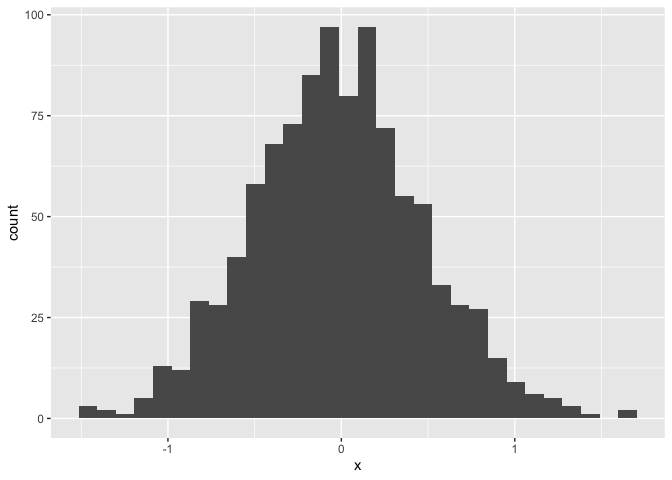
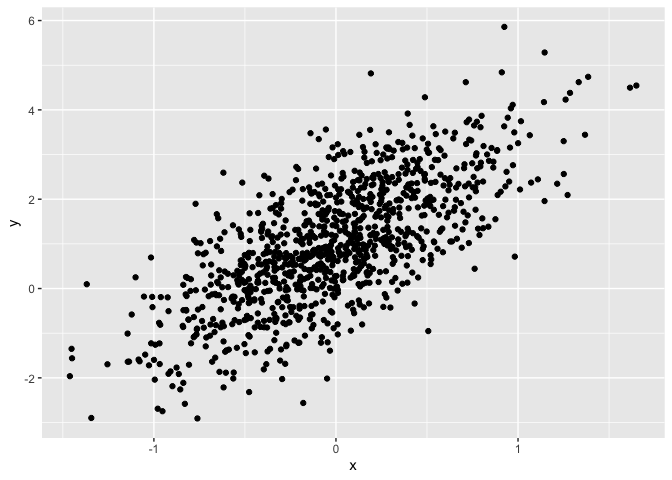
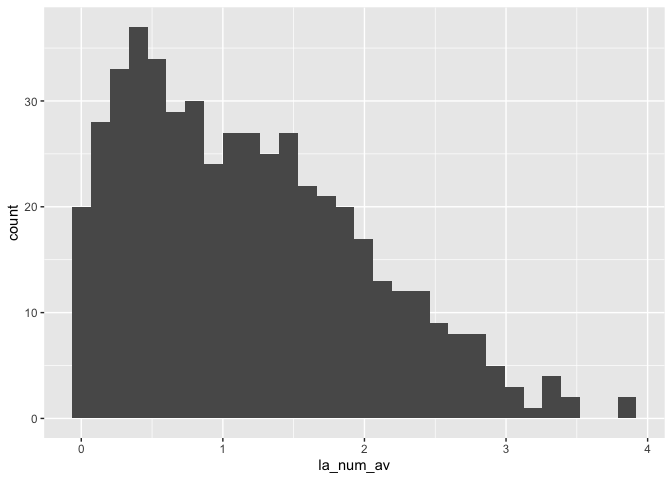

Not Simple document
================
Robert Ariss
2026-09-25

I’m an R Markdown document!

# Section 0: libraries

``` r
library(tidyverse)
```

# Section 1

Here’s a **code chunk** that samples from a *normal distribution*:

``` r
samp = rnorm(100)
length(samp)
```

    ## [1] 100

# Section 2

I can take the mean of the sample, too! The mean is -0.1291012.

# Section 3: a tibble

    ## # A tibble: 6 × 2
    ##        x      y
    ##    <dbl>  <dbl>
    ## 1  0.153 0.658 
    ## 2 -0.408 1.40  
    ## 3  1.39  4.74  
    ## 4  0.192 1.19  
    ## 5  0.215 1.20  
    ## 6 -0.272 0.0306

# Section 4: a plot

``` r
ggplot(plot_df, aes(x = x)) + geom_histogram()
```

    ## `stat_bin()` using `bins = 30`. Pick better value `binwidth`.

<!-- -->

``` r
ggplot(plot_df, aes(x = x, y = y)) + geom_point()
```

<!-- -->

# Section 5: learning assessment

``` r
la_df = 
  tibble(
    la_num = rnorm(500, mean = 1),
    la_fac = la_num > 0,
    la_num_av = abs(la_num)
  )

ggplot(la_df, aes(x = la_num_av)) + geom_histogram()
```

    ## `stat_bin()` using `bins = 30`. Pick better value `binwidth`.

<!-- -->

``` r
median_la_num = median(pull(la_df, la_num))
```

The median of the variable containing absolute values is 0.99

# Section 6: formatting

## Text formatting

*italic* or *italic* **bold** or **bold** `code` superscript<sup>2</sup>
and subscript<sub>2</sub>

## Headings

# 1st Level Header

## 2nd Level Header

### 3rd Level Header

## Lists

- Bulleted list item 1

- Item 2

  - Item 2a

  - Item 2b

1.  Numbered list item 1

2.  Item 2. The numbers are incremented automatically in the output.

## Tables

| First Header | Second Header |
|--------------|---------------|
| Content Cell | Content Cell  |
| Content Cell | Content Cell  |

# Section 7: Learning Assessment 3

- The median is 0.99

- The mean is 0.99

- The standard deviation is 1.06

Histogram

``` r
ggplot(plot_df, aes(x = x)) + geom_histogram()
```

    ## `stat_bin()` using `bins = 30`. Pick better value `binwidth`.

<!-- -->
